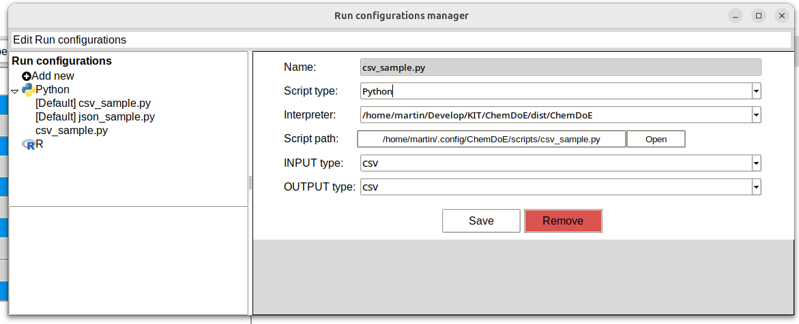

Executing Scripts
=================

Given the extensive and varied nature of the algorithms employed in the development of the experimental design, it is impracticable to address the full range of potential requirements of a scientist working with Chemotion. One potential solution to this challenge is the incorporation of user-defined scripts as execution scripts within the ChemDoE framework. However, it is imperative to ensure the seamless integration and collaboration between these custom scripts and ChemDoE. To this end, it is essential that the scripts adhere to certain criteria to facilitate effective cooperation. The subsequent sections will delve into these criteria in greater detail.

General Requirements
---------------------

It is important to note that ChemDoE is only compatible with Python and R scripts. Therefore, it is necessary to have a Python and R interpreter installed on the device. Ideally, users should ensure that they have the most recent version of these interpreters installed. Specifically, for Python, the minimum version required is 3.12.

How to develop your on Script
-----------------------------

First you have to decide which of the two languages: R or Python will be used. It is essential to choose the interpreter, especially if you decide in favour of Python.

   The Run configurations manager in the ChemDoE
