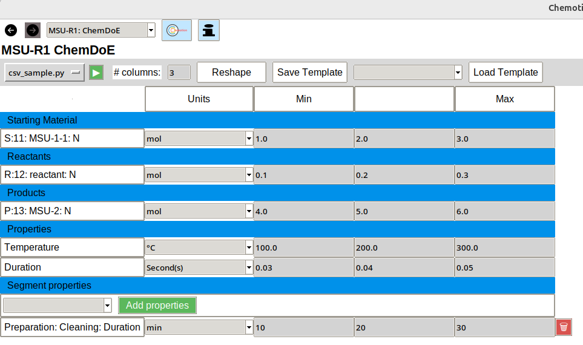

Run Scripts
=================

Given the extensive and varied nature of the algorithms employed in the development of the experimental design, it is impracticable to address the full range of potential requirements of a scientist working with Chemotion. One potential solution to this challenge is the incorporation of user-defined scripts as execution scripts within the ChemDoE framework. However, it is imperative to ensure the seamless integration and collaboration between these custom scripts and ChemDoE. To this end, it is essential that the scripts adhere to certain criteria to facilitate effective cooperation. The subsequent sections will delve into these criteria in greater detail.

General Requirements
---------------------

It is important to note that ChemDoE is only compatible with Python and R scripts. Therefore, it is necessary to have a Python and R interpreter installed on the device. Ideally, users should ensure that they have the most recent version of these interpreters installed. Specifically, for Python, the minimum version required is 3.12.

How to develop your on Script
-----------------------------

A number of design options must be made in advance. Specifically, a programming language, an input file format and an output file format must be selected.

.. list-table:: Script Design options
   :widths: 33 33 33
   :header-rows: 1

   * - Language
     - Input File
     - Output File
   * - Python
     - CSV
     - CSV
   * - R
     - JSON
     - JSON

ChemDoE provides a comprehensive list of assistance positions that facilitate the creation of a script. For a more detailed exposition of the requirements and these assistance items, please refer to the chapters  :doc:`python_script` and  :doc:`r_script`.

Input and output file format
----------------------------

Prior to delving into the intricacies of the assistance and prerequisites of the script, it is imperative to elucidate the corresponding file format of the input and output files. The input and output files are structured according to the example shown in Figure 2.

   **Figure 2:** An example of a DoE table.

Input JSON
++++++++++

.. literalinclude:: examples/json_sample.json
   :language: json

Input CSV
++++++++++

.. csv-table:: Input CSV file
   :file: examples/csv_sample.csv

Output JSON
+++++++++++

.. literalinclude:: examples/out_json_sample.json
   :language: json

Output CSV
++++++++++

.. csv-table:: Input CSV file
   :file: examples/out_csv_sample.csv

