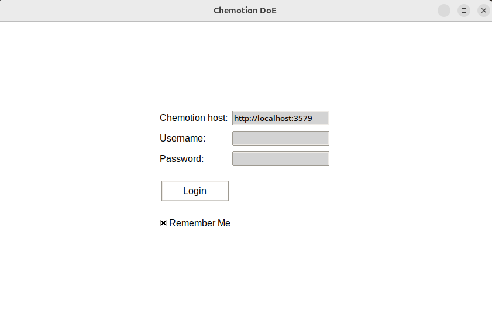

Getting Started
===============

This instrument is to be integrated into the software ecosystem of the ELN Chemotion. It is a graphical user interface (GUI) client that facilitates the utilization of design of experiment algorithms to populate the variations of a reaction in Chemotion.

.. _sec-install:

How to run it
-------------

ChemDoE is a GUI client that has been developed using the Python programming language. It utilizes the Chemotion API to facilitate interaction with a designated Chemotion instance. Presently, a portable version that is compatible with both Windows and Linux operating systems is available for download on the GitHub platform. The utilization of this portable executable does not necessitate its installation. Instead, users can simply copy it to a directory of their choosing, such as their desktop, and execute it.

Download version 0.1.1:

- `Windows <https://github.com/StarmanMartin/ChemDoE/releases/download/v0.1.1/ChemDoE.exe>`_
- `Linux <https://github.com/StarmanMartin/ChemDoE/releases/download/v0.1.1/ChemDoE>`_

Alternatively, you can also install it via PyPI. To do this, simply enter the following command in the console:

.. code-block:: console

    pip install ChemDoE

Then run:

.. code-block:: console

    ChemDoE run

Requirements
------------

To leverage the full potential of ChemDoE, it is essential to have an accessible `R <https://www.r-project.org/>`_ interpreter and a `Python <https://www.python.org/downloads/>`_ interpreter (version >= 3.12) installed on your device.

First execution
---------------

1. Simpy run the executable file downloaded from Github.

   **Figure 1:** ChemDoE login screen.